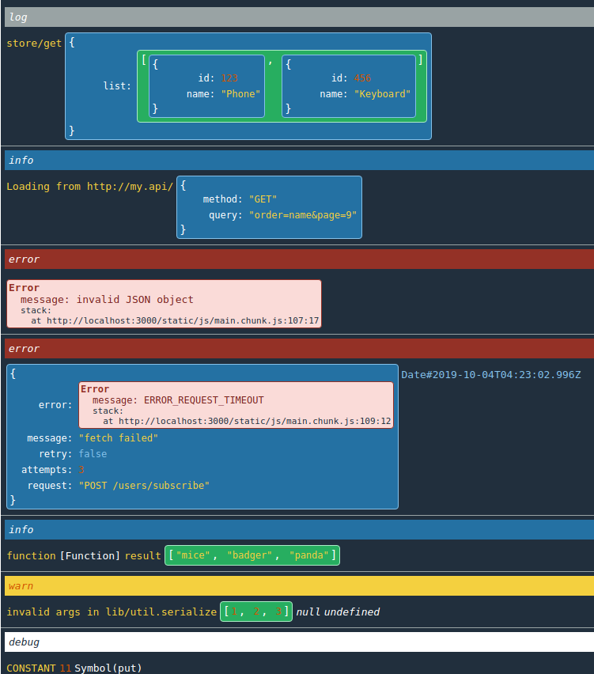
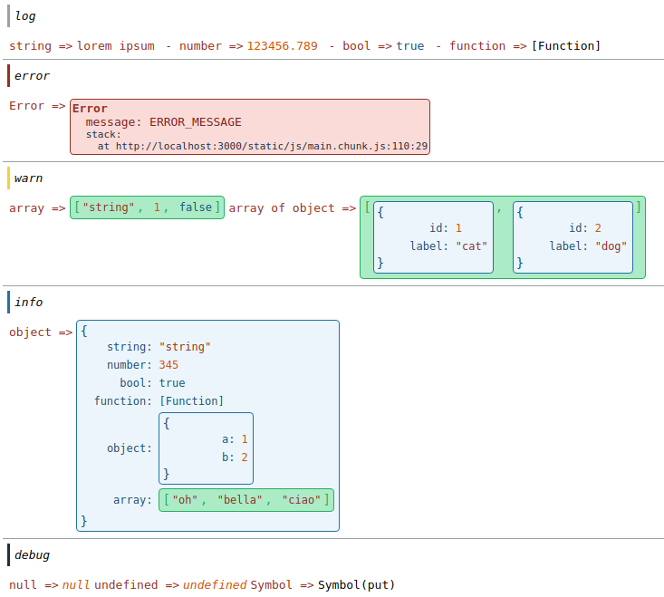
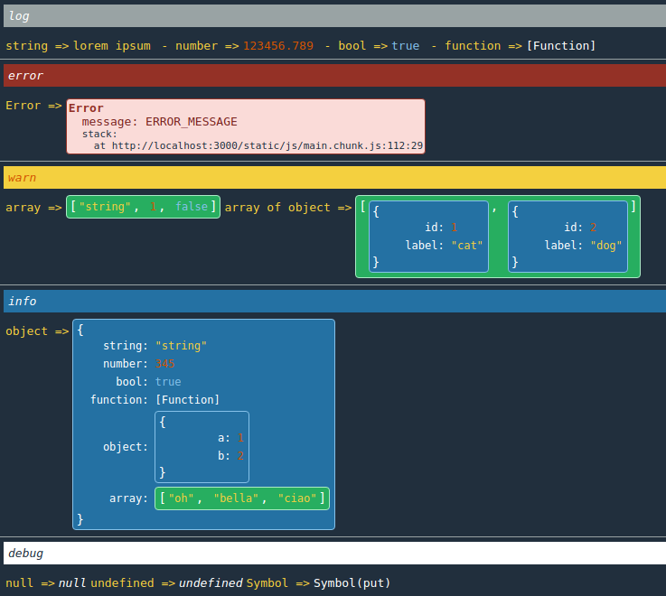

# react-display-console

Display the `console` inside React app



## Install

```
npm i react-display-console --production
```

## Usage

```jsx
import Console from 'react-display-console'

<Console input theme='dark' />

...

console.log('store/get', { list: [{ id: 123, name: 'Phone' }, { id: 123, name: 'Keyboard' }] })
console.info('Loading from http://my.api/', { method: 'GET', query: 'order=name&page=9' })
console.error(new Error('invalid JSON object'))

```

### props

- **input**
  show input at bottom to write statements, like in real `console`

- **theme** (optional)
  use a theme class; available builtin themes are:

  - `default`  


  - `dark`  



## How it works

When the component is invoked, it wrap `console` methods and it use them in a `React.context`, so any call relay to `<Console>` component and regular `console`.

## How to add and use a custom theme

Define a css style for `.console`, for example `.console.my` (see `src/style/themes.scss` for example and class definition). Use the prop `theme='my'` in `<Console>`

- `my.css`

```css
.console.my {
  background-color: grey;
  color: darkblue;

  ...
}
```

then

```jsx
<Console theme='my' />
```

## Purpose

`react-display-console` component arises from the need to view the console output in the browser for educational, development or debugging purposes, especially when it's difficult to access devtools in non-desktop environments (mobile, TV etc).

## Contribute

Feel free to contribute! 🤩  
There are no strict rules, any reasonable PR will be accepted 👍

---

## Next

- [ ] display correct source file and line in Error stack (use sourcemap?)
- [ ] display `at file:line` (use sourcemap?)
- [ ] `clear` button

---

## License

The MIT License (MIT)

Copyright (c) 2019 | Simone Sanfratello

Permission is hereby granted, free of charge, to any person obtaining a copy
of this software and associated documentation files (the "Software"), to deal
in the Software without restriction, including without limitation the rights
to use, copy, modify, merge, publish, distribute, sublicense, and/or sell
copies of the Software, and to permit persons to whom the Software is
furnished to do so, subject to the following conditions:

The above copyright notice and this permission notice shall be included in all
copies or substantial portions of the Software.

THE SOFTWARE IS PROVIDED "AS IS", WITHOUT WARRANTY OF ANY KIND, EXPRESS OR
IMPLIED, INCLUDING BUT NOT LIMITED TO THE WARRANTIES OF MERCHANTABILITY,
FITNESS FOR A PARTICULAR PURPOSE AND NONINFRINGEMENT. IN NO EVENT SHALL THE
AUTHORS OR COPYRIGHT HOLDERS BE LIABLE FOR ANY CLAIM, DAMAGES OR OTHER
LIABILITY, WHETHER IN AN ACTION OF CONTRACT, TORT OR OTHERWISE, ARISING FROM,
OUT OF OR IN CONNECTION WITH THE SOFTWARE OR THE USE OR OTHER DEALINGS IN THE
SOFTWARE.

